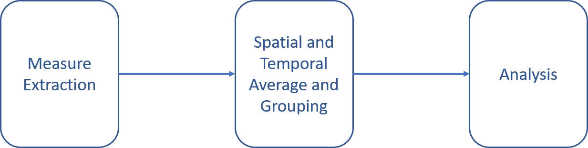
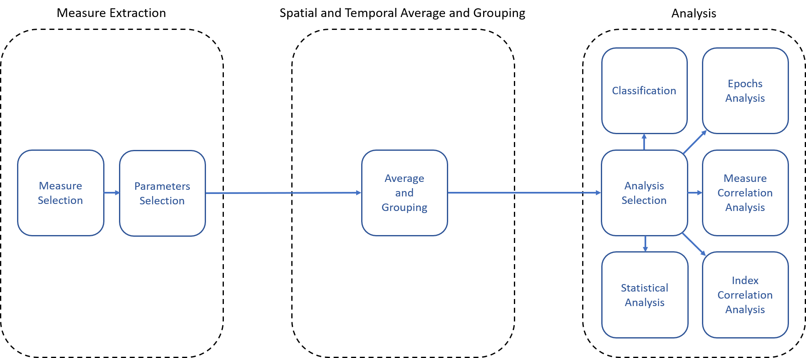

# ATHENA

  

***ATHENA*** *(Automatic Toolbox for Handling Experimental Neural Analysis)* is a toolbox which allow to
automatically extract commonly analyzed measures, used to study neural time series, such as EEG and MEG. 
These measures, which can be connectivity, power or background measures, can be studied through this toolbox, through correlation and 
statistical analysis.

The *pipeline* followed by this toolbox is easy and repetible.
It is possible to choose between a guided or a batch mode:
- The guided mode drives the user throw all the steps which compose the pipeline, allowing him to change parameters during the study
- The batch mode allows the user to compute the entire study automatically, chosing all the parameters before starting it

  

The *pipeline* provided by *ATHENA* can be subdivided in 3 main steps:
1) **Feature Engineering**: in this step the  user can choose the measure to extract and its parameters as sampling frequency, cut
   frequencies to define the studied frequency bands, the number of epochs and the time window of each one and the starting time, extract 
   it, and finally compute the temporal and spatial average of the measure values and subdivide the studied subjects in their group
2) **Analysis**: in this step the user can choose the analysis to compute, between statistical and visual analysis, and their parameters
3) **Classification**: in this step the user can build a random forest, a decision tree or a multi-layer neural network classifier and its
   performance, allowing to change parameters and to study the discriminant capability of the extracted measures

  

It is also possible to **display the signals**, easily switching between them if they are contained in the same directory.
The graphic interface allows:
- To *zoom* or *dezoom* the signal for a better visualization
- To choose the *length of the time window* to show
- To select a *specific time instant* to look at
- To *change the sampling frequency* (if it is not already present inside the signal files)
- To *select the locations* to show
- To *save a piece of signal*, by choosing the *starting time*, the *locations* and the *length of the time window* to save

## Measure extraction
The measures extractably by ATHENA can be divided in:
- *Connectivity measures*
  - **PLI** (Phase Lag Index)
  - **PLV** (Phase Locking Value)
  - **AEC** (Amplitude Envelope Correlation)
  - **corrected AEC** (Amplitude Envelope Correlation)
- *Power measures*
  - **relative PSD** (Power Spectral Density) 
- *Background measures*
  - **Exponent**
  - **Offset**
  
  
The *parameters* to choose to extract the measures are:
- **fs**: it is the sampling frequency, it can be automatically chosen if the parameter is present in the time series
- **cf**: it is the list of cut frequencies, they define each studied frequency band which will be define between two of the chosen cut 
      frequencies
- **epochs number**: it is the number of time epochs to study
- **epochs time**: it is the time window of each epoch
- **starting time**: it is the starting time of the first epoch, it is useful to avoid initial noise or altered signal due to preprocessing,
       sources reconstruction, etc.
- **relative band**: it is used to extract the relative PSD as relative band

## Averaging and Grouping
In this step a table which contains the subjects names and their group (patients group or healthy controls group) is required.
If it is not present, the user can select the patients between the subject list in a graphic interface that will be create by *ATHENA*
if the button **␚** is pressed and save the resulting table to use it to compute the step.

## Analysis
For every analysis a file which contains the locations representing each row of the time series is requested.
This file allow to choose to compute the analysis on the measure pattern of *each location*, on the *asymmetry* between the pattern of the
right hemisphere and the left one, on the *global* pattern or on the *frontal, temporal, central, parietal and occipital areas*.
Furthermore, the user can select the conservativeness level which will define the alpha level for the correlation and statistical
analysis.
In these analysis, the results will be showed to the user through a p-values table and the significant results will be showed through a
table and in a graphical way.
It also possible to investigate the differences intra-subject of the values of a measure in the epochs, or to compute other visual analysis

The user can choose between various statistical analysis:
- **U Test**: the user can verify the presence of statistical differences between the patterns of the patients and the patterns of the
       healthy controls
- **Index Correlation analysis**: the user can verify the correlation between a group pattern and an index corresponding to each
       subject, an external file containing the index for each subject is required
- **Measures Correlation analysis**: the user can verify the presence of a correlation in a group between the patterns of two different
       measures
- **Distribution analysis**: the user can compare the distribution of a measure of the group of patients with the one of the group of healty 
  controls

Furthermore, the user can execute some visual analysis:
- **Scatter Plot analysis**: the user can visually analyze the scatter plot related to two measures, also with different spatial and 
       frequency parameters, or to different parameters of the same measure
- **Epochs Analysis**: the user can study the variation of a measure through the epochs in every frequency band for a subject

## Classification
Finally, the user can train and test a **Decision Tree** classifier, a **Random Forest** classifier or a Multi-Layer **Neural Network** classifier in order 
to verify the discriminant capability of the extracted features and to check if it is possible to distinguish between the two groups of subjects.

The user can also **merge the data of the significant results** of every previously computed statistical analysis in a csv file which
can be used for a classification or other external analysis.

## The wiki
For any doubt, you can consult the [toolbox **wiki**](https://github.com/smlacava/Athena/wiki/Home). 

> The toolbox is still under construction
